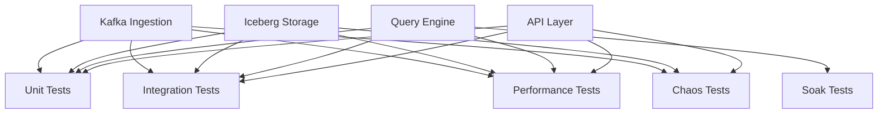

# Testing Architecture Documentation

## Executive Summary

The K2 Market Data Platform testing architecture is designed to ensure reliability, performance, and data accuracy for a real-time streaming data pipeline. This document provides comprehensive technical details for staff engineers reviewing the framework design and implementation.

## System Context

### Platform Overview
The K2 platform processes real-time market data through the following pipeline:
```
External Data Sources → Kafka Ingestion → Iceberg Lakehouse → Query Engine → API Layer
```

### Critical Quality Attributes
1. **Data Accuracy**: 99.99%+ data fidelity through the pipeline
2. **Low Latency**: < 100ms query response (p95)
3. **High Throughput**: > 10,000 msg/sec ingestion capacity
4. **Fault Tolerance**: Graceful degradation under failures
5. **Scalability**: Linear performance scaling with data volume

## Architecture Decisions

### Decision 2025-01-16: Multi-Layer Testing Strategy
**Rationale**: Different failure modes require different testing approaches
**Trade-offs**: Increased complexity vs. comprehensive coverage
**Alternatives Considered**: Single-layer testing (rejected - insufficient coverage)

### Decision 2025-01-16: Risk-Based Coverage
**Rationale**: Focus testing resources on high-impact components
**Trade-offs**: Some areas have lower coverage vs. efficient resource use
**Alternatives Considered**: 100% coverage (rejected - too slow for market data)

### Decision 2025-01-16: Production-Like Test Environment
**Rationale**: Catch environment-specific issues early
**Trade-offs**: Higher resource requirements vs. realistic testing
**Alternatives Considered**: Mocked services (rejected - insufficient realism)

## Detailed Architecture

### Test Layer Matrix

| Layer | Purpose | Target Time | Dependencies | Coverage Focus |
|-------|---------|-------------|--------------|----------------|
| Unit | Business logic validation | < 100ms | None | Code paths, edge cases |
| Integration | Component interaction | < 30s | Docker services | Data flow, contracts |
| Performance | Benchmark validation | Variable | Full stack | Throughput, latency |
| Chaos | Failure resilience | Variable | Destructive | Recovery, degradation |
| Soak | Endurance testing | Hours | Production | Stability, leaks |

### Component Coverage Map



### Infrastructure Architecture

#### Test Environment Topology
```
┌─────────────────┐    ┌─────────────────┐    ┌─────────────────┐
│   Test Runner   │    │  Docker Network │    │  External Services│
│                 │    │                 │    │                 │
│ - pytest       │◄──►│ - Kafka Cluster │◄──►│ - Binance API   │
│ - fixtures     │    │ - MinIO S3      │    │ - Market Data   │
│ - mocks        │    │ - DuckDB       │    │                 │
└─────────────────┘    └─────────────────┘    └─────────────────┘
```

#### Resource Allocation
- **Unit Tests**: 2GB RAM, 1 CPU core
- **Integration Tests**: 4GB RAM, 2 CPU cores
- **Performance Tests**: 8GB RAM, 4 CPU cores
- **Chaos Tests**: 4GB RAM, 2 CPU cores (isolated)

## Implementation Details

### Fixture Architecture

#### Global Fixtures (conftest.py)
```python
@pytest.fixture(scope="session")
def kafka_cluster():
    """Dockerized Kafka cluster with auto-cleanup."""
    
@pytest.fixture(scope="session") 
def iceberg_catalog():
    """MinIO-backed Iceberg catalog for storage tests."""
    
@pytest.fixture(scope="function")
def sample_market_data():
    """Realistic market data for testing."""
```

#### Component Fixtures
```python
@pytest.fixture(scope="function")
def producer_config(kafka_cluster):
    """Validated Kafka producer configuration."""
    
@pytest.fixture(scope="function")
def storage_backend(iceberg_catalog):
    """Temporary Iceberg table with auto-cleanup."""
```

### Test Data Strategy

#### Data Generation Hierarchy
1. **Synthetic Data**: Faker-generated for unit tests
2. **Sample Data**: Realistic fixtures for integration tests
3. **Property-Based**: Hypothesis-generated for edge cases
4. **Production Data**: Anonymized real data for soak tests

#### Data Volume Management
```python
DATA_SIZES = {
    "unit": "1KB",          # In-memory objects
    "integration": "10MB",  # Sample datasets  
    "performance": "1GB",   # Benchmark datasets
    "soak": "unlimited"     # Continuous stream
}
```

### Performance Testing Framework

#### Benchmark Categories
1. **Throughput Tests**: Messages per second
2. **Latency Tests**: Response time percentiles
3. **Resource Tests**: Memory/CPU utilization
4. **Scalability Tests**: Performance vs. data size

#### Baseline Metrics
```python
PERFORMANCE_BASELINES = {
    "kafka_throughput": "10,000 msg/sec",
    "query_latency_p95": "100ms",
    "ingestion_memory": "2GB",
    "api_response_p95": "50ms"
}
```

### Chaos Engineering Framework

#### Failure Injection Matrix
| Failure Type | Method | Detection | Recovery |
|--------------|--------|-----------|----------|
| Kafka Broker | Docker stop | Connection error | Auto-reconnect |
| Network Partition | Network delay | Timeout | Retry logic |
| Storage Corruption | File modification | Checksum error | Data restoration |
| Resource Exhaustion | Memory limit | OOM error | Process restart |

#### Chaos Test Structure
```python
@pytest.mark.chaos
def test_kafka_broker_failure(kafka_cluster, producer):
    """Test system behavior when Kafka broker fails."""
    with chaos_kafka_broker_failure(kafka_cluster):
        # Verify graceful degradation
        assert producer.is_degraded()
        # Verify recovery when broker returns
```

## Quality Assurance

### Coverage Requirements

#### Code Coverage Targets
- **Unit Tests**: 85% line coverage on business logic
- **Integration Tests**: 70% coverage on critical paths
- **Overall Coverage**: 75% combined coverage

#### Coverage Exclusions
```python
# Coverage exclusions (pyproject.toml)
omit = [
    "*/tests/*",
    "*/test_*.py", 
    "*/__pycache__/*",
    "*/site-packages/*",
    "*/migrations/*",  # Database migrations
    "*/scripts/*",     # Utility scripts
]
```

### Test Quality Standards

#### Reliability Requirements
- **Pass Rate**: > 95% on CI pipeline
- **Flaky Tests**: Zero tolerance for critical paths
- **Execution Time**: Unit tests < 100ms, integration < 30s

#### Resource Management
- **Memory Leaks**: Zero tolerance in soak tests
- **Container Cleanup**: 100% cleanup verification
- **Connection Leaks**: Automatic connection pooling cleanup

## CI/CD Integration

### Pipeline Architecture
```yaml
stages:
  - validate    # Code quality and static analysis
  - test_unit   # Fast unit tests with parallel execution
  - test_integration # Component tests with services
  - test_performance # Benchmark validation
  - security    # Security scanning and vulnerability checks
  - deploy      # Deployment to staging/production
```

### Test Execution Strategy
```bash
# Development workflow
pytest tests/unit/ -n auto                    # Fast feedback
pytest tests/integration/ --start-services    # Full integration
pytest tests/performance/ --benchmark-only    # Performance validation

# CI workflow
pytest --cov=k2 --benchmark --strict-markers  # Complete validation
```

### Resource Optimization
- **Parallel Execution**: Unit tests use all available cores
- **Docker Caching**: Service containers cached between runs
- **Test Selection**: Smart test selection based on changes
- **Resource Limits**: Memory and CPU limits to prevent OOM

## Monitoring and Observability

### Test Metrics Collection
```python
# Metrics collected during test execution
TEST_METRICS = {
    "execution_time": "Test duration percentiles",
    "resource_usage": "CPU, memory, disk utilization", 
    "pass_rate": "Success rate by test category",
    "coverage": "Code coverage trends",
    "flakiness": "Test reliability metrics"
}
```

### Debugging Support
- **Structured Logging**: Test context in all logs
- **Prometheus Metrics**: Real-time test execution metrics
- **Jaeger Tracing**: Request flow visualization
- **Artifact Collection**: Failure artifacts for debugging

## Risk Assessment

### High-Risk Components
1. **Kafka Ingestion**: Data loss potential
2. **Iceberg Storage**: Query accuracy impact
3. **Query Engine**: Performance regression risk
4. **API Layer**: Availability impact

### Mitigation Strategies
1. **Redundant Testing**: Multiple test types for critical components
2. **Performance Baselines**: Automated regression detection
3. **Chaos Testing**: Proactive failure identification
4. **Monitoring**: Real-time issue detection

## Future Considerations

### Scalability Planning
- **Test Volume**: Accommodate 10x test growth
- **Parallel Execution**: Support for distributed testing
- **Resource Management**: Dynamic resource allocation
- **Performance**: Maintain sub-30min full test suite

### Technology Evolution
- **Container Orchestration**: Kubernetes-based test execution
- **Cloud Integration**: Cloud-native testing services
- **AI/ML Testing**: Intelligent test selection and generation
- **Observability**: Advanced monitoring and alerting

## Review Checklist

### For Staff Engineers
- [ ] Architecture aligns with platform requirements
- [ ] Resource requirements are reasonable for CI/CD
- [ ] Coverage strategy addresses critical risks
- [ ] Performance baselines are realistic and measurable
- [ ] Chaos testing covers relevant failure scenarios
- [ ] Documentation is comprehensive and maintainable
- [ ] Implementation plan is achievable and well-structured

### Technical Validation
- [ ] Fixture design is efficient and reusable
- [ ] Test data strategy supports all test types
- [ ] Performance testing methodology is sound
- [ ] CI/CD integration is robust and reliable
- [ ] Monitoring provides adequate visibility
- [ ] Quality gates prevent regressions

## Conclusion

This testing architecture provides comprehensive coverage for the K2 Market Data Platform while maintaining development velocity and operational efficiency. The multi-layer approach ensures that different types of failures are caught at the appropriate testing level, from fast unit tests to comprehensive chaos engineering.

The design balances thoroughness with practicality, focusing resources on the most critical components while providing a framework for incremental improvement as the platform evolves.

---

**Document Version**: 1.0  
**Last Updated**: 2025-01-16  
**Next Review**: 2025-02-01  
**Author**: K2 Platform Team  
**Reviewers**: Staff Engineering Committee