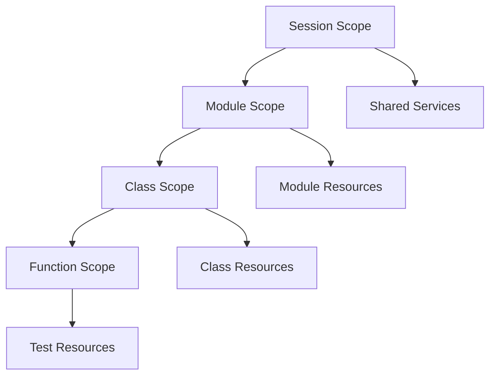

# Fixture Design and Implementation Guide

## Overview

This document provides comprehensive guidance on designing, implementing, and maintaining test fixtures for the K2 Market Data Platform testing framework. Fixtures are critical for test reliability, resource management, and maintainability.

## Fixture Philosophy

### Design Principles
1. **Isolation**: Each test gets a clean, independent environment
2. **Efficiency**: Minimal setup/teardown overhead
3. **Reusability**: Fixtures composable across test types
4. **Safety**: Automatic resource cleanup and leak prevention
5. **Clarity**: Self-documenting fixture behavior

### Resource Management Strategy
```python
# Fixture lifecycle management
@pytest.fixture(scope="function")
def resource():
    """Automatic resource cleanup with context managers."""
    with Resource() as resource:
        yield resource
    # Automatic cleanup on exit
```

## Fixture Architecture

### Scope Hierarchy


### Scope Selection Guidelines

| Scope | Use Case | Duration | Resource Impact |
|-------|----------|----------|-----------------|
| `session` | External services (Kafka, MinIO) | Test run | High (shared) |
| `module` | Database connections, file systems | Module | Medium |
| `class` | Configuration, authentication | Test class | Low |
| `function` | Test data, temporary resources | Single test | Minimal |

## Core Fixtures Implementation

### Session-Scoped Fixtures

#### Kafka Cluster Fixture
```python
@pytest.fixture(scope="session")
def kafka_cluster():
    """Dockerized Kafka cluster with auto-cleanup.
    
    Provides:
    - Kafka broker URL
    - Schema registry URL
    - Auto-created test topics
    - Health verification
    
    Yields:
        KafkaCluster: Configured cluster interface
    """
    cluster = KafkaCluster(
        num_brokers=1,
        schema_registry=True,
        topics=["test-trades", "test-quotes", "test-reference"]
    )
    
    try:
        cluster.start()
        # Wait for health check
        cluster.wait_for_health(timeout=30)
        yield cluster
    finally:
        cluster.stop()
        cluster.cleanup()
```

#### Iceberg Catalog Fixture
```python
@pytest.fixture(scope="session")
def iceberg_catalog():
    """MinIO-backed Iceberg catalog for storage tests.
    
    Provides:
    - S3-compatible storage backend
    - Iceberg catalog configuration
    - Temporary namespace isolation
    - Automatic cleanup
    
    Yields:
        IcebergCatalog: Configured catalog interface
    """
    catalog = IcebergCatalog(
        backend="minio",
        namespace=f"test_{uuid.uuid4().hex[:8]}"
    )
    
    try:
        catalog.start()
        yield catalog
    finally:
        catalog.stop()
        catalog.cleanup()
```

### Function-Scoped Fixtures

#### Sample Market Data Fixture
```python
@pytest.fixture(scope="function")
def sample_market_data():
    """Realistic market data for testing.
    
    Generates:
    - Trade data with proper sequencing
    - Quote data with bid/ask spreads
    - Reference data with corporate actions
    - Timestamps in market hours
    
    Returns:
        MarketData: Structured test data
    """
    return MarketDataFactory.create(
        symbols=["AAPL", "GOOGL", "MSFT"],
        start_time=datetime.now() - timedelta(hours=1),
        end_time=datetime.now(),
        data_types=["trades", "quotes", "reference"]
    )
```

#### Producer Configuration Fixture
```python
@pytest.fixture(scope="function")
def producer_config(kafka_cluster):
    """Validated Kafka producer configuration.
    
    Provides:
    - Connection configuration
    - Schema registry settings
    - Serialization configuration
    - Retry and error handling
    
    Args:
        kafka_cluster: Session-scoped Kafka cluster
        
    Returns:
        ProducerConfig: Validated configuration
    """
    return ProducerConfig(
        bootstrap_servers=kafka_cluster.brokers,
        schema_registry_url=kafka_cluster.schema_registry,
        value_serializer="avro",
        error_handling="retry",
        max_retries=3
    )
```

## Specialized Fixtures

### Performance Testing Fixtures
```python
@pytest.fixture(scope="function")
def performance_dataset():
    """Large dataset for performance testing.
    
    Generates:
    - 1GB+ of realistic market data
    - Multiple symbols and data types
    - Time-appropriate distribution
    - Compressed for efficient loading
    
    Returns:
        PerformanceDataset: Large test dataset
    """
    return PerformanceDatasetFactory.create(
        size_gb=1,
        symbols=100,
        data_types=["trades", "quotes"],
        time_range="1day"
    )
```

### Chaos Testing Fixtures
```python
@pytest.fixture(scope="function")
def chaos_environment(kafka_cluster, iceberg_catalog):
    """Isolated environment for chaos testing.
    
    Provides:
    - Service failure injection
    - Network partition simulation
    - Resource exhaustion testing
    - Recovery verification
    
    Args:
        kafka_cluster: Kafka cluster for failure injection
        iceberg_catalog: Storage backend for corruption tests
        
    Returns:
        ChaosEnvironment: Chaos testing interface
    """
    return ChaosEnvironment(
        services=[kafka_cluster, iceberg_catalog],
        failure_types=["broker_failure", "network_partition", "disk_full"]
    )
```

## Fixture Composition

### Complex Fixture Assembly
```python
@pytest.fixture(scope="function")
def complete_ingestion_pipeline(kafka_cluster, iceberg_catalog, sample_market_data):
    """Complete ingestion pipeline for integration testing.
    
    Assembles:
    - Kafka producer with schema registry
    - Iceberg storage backend
    - Data validation and monitoring
    - Error handling and recovery
    
    Args:
        kafka_cluster: Kafka infrastructure
        iceberg_catalog: Storage infrastructure
        sample_market_data: Test data source
        
    Returns:
        IngestionPipeline: Complete pipeline interface
    """
    producer = KafkaProducer(
        config=producer_config(kafka_cluster),
        topic="test-trades"
    )
    
    storage = IcebergStorage(
        catalog=iceberg_catalog,
        table="test_trades"
    )
    
    validator = DataValidator(schema=TradeSchema())
    
    return IngestionPipeline(
        producer=producer,
        storage=storage,
        validator=validator,
        monitoring=PipelineMonitor()
    )
```

### Parameterized Fixtures
```python
@pytest.fixture(scope="function", params=["avro", "json", "protobuf"])
def serialization_format(request):
    """Parameterized serialization format testing.
    
    Tests:
    - Avro serialization with schema registry
    - JSON serialization for debugging
    - Protobuf serialization for performance
    
    Args:
        request: Pytest request with parameter
        
    Returns:
        SerializationFormat: Format configuration
    """
    return SerializationFormat(request.param)
```

## Resource Management

### Memory Management
```python
@pytest.fixture(scope="function")
def memory_intensive_dataset():
    """Memory-safe large dataset fixture.
    
    Implements:
    - Streaming data generation
    - Memory usage monitoring
    - Automatic cleanup
    - OOM prevention
    
    Yields:
        Generator: Streaming data generator
    """
    def data_generator():
        for chunk in generate_large_dataset():
            yield chunk
            # Force garbage collection periodically
            if chunk.index % 1000 == 0:
                gc.collect()
    
    try:
        yield data_generator()
    finally:
        # Ensure memory cleanup
        gc.collect()
```

### Connection Management
```python
@pytest.fixture(scope="function")
def database_connection():
    """Database connection with automatic cleanup.
    
    Provides:
    - Connection pooling
    - Transaction management
    - Error handling
    - Resource cleanup
    
    Yields:
        DatabaseConnection: Managed database connection
    """
    connection = DatabaseConnection(
        connection_string=TEST_DATABASE_URL,
        pool_size=5,
        max_overflow=10
    )
    
    try:
        connection.connect()
        yield connection
    finally:
        connection.close()
        connection.cleanup()
```

## Error Handling and Recovery

### Fault-Tolerant Fixtures
```python
@pytest.fixture(scope="function")
def resilient_service():
    """Service fixture with automatic recovery.
    
    Implements:
    - Health checking
    - Automatic restart
    - Error logging
    - Graceful degradation
    
    Yields:
        ResilientService: Self-healing service interface
    """
    service = ResilientService(
        config=service_config,
        health_check_interval=5,
        max_restart_attempts=3
    )
    
    try:
        service.start()
        yield service
    finally:
        service.stop()
```

### Cleanup Verification
```python
@pytest.fixture(scope="function")
def verified_cleanup():
    """Fixture with cleanup verification.
    
    Verifies:
    - No leaked connections
    - No temporary files
    - No memory leaks
    - No container remnants
    
    Yields:
        CleanupVerifier: Resource tracking interface
    """
    tracker = ResourceTracker()
    
    try:
        yield tracker
    finally:
        # Verify cleanup
        assert tracker.no_leaked_connections(), "Connection leak detected"
        assert tracker.no_temporary_files(), "Temporary files not cleaned"
        assert tracker.no_memory_leaks(), "Memory leak detected"
        assert tracker.no_container_remnants(), "Docker containers not cleaned"
```

## Best Practices

### Fixture Design Guidelines
1. **Single Responsibility**: Each fixture has one clear purpose
2. **Minimal Dependencies**: Prefer function scope over session scope
3. **Explicit Cleanup**: Always include try/finally blocks
4. **Resource Monitoring**: Track resource usage during tests
5. **Error Isolation**: Prevent fixture errors from affecting tests

### Performance Optimization
```python
# Good: Lazy initialization
@pytest.fixture(scope="function")
def lazy_resource():
    """Resource initialized only when needed."""
    if not hasattr(lazy_resource, "_instance"):
        lazy_resource._instance = ExpensiveResource()
    return lazy_resource._instance

# Bad: Eager initialization
@pytest.fixture(scope="function")
def eager_resource():
    """Resource always initialized, even if not used."""
    return ExpensiveResource()  # Wastes resources if unused
```

### Testing Fixture Reliability
```python
def test_fixture_reliability(kafka_cluster):
    """Verify fixture reliability and cleanup."""
    # Test fixture provides expected interface
    assert kafka_cluster.is_healthy()
    assert kafka_cluster.brokers is not None
    
    # Test resource isolation
    initial_topics = kafka_cluster.list_topics()
    # ... test logic ...
    final_topics = kafka_cluster.list_topics()
    assert len(final_topics) == len(initial_topics)
```

## Troubleshooting

### Common Fixture Issues

#### Resource Leaks
```python
# Symptom: Tests fail with "resource already in use"
# Solution: Verify fixture scope and cleanup

@pytest.fixture(scope="function")
def fixed_resource():
    resource = ExpensiveResource()
    try:
        yield resource
    finally:
        resource.cleanup()  # Ensure explicit cleanup
```

#### Race Conditions
```python
# Symptom: Intermittent test failures
# Solution: Add proper synchronization

@pytest.fixture(scope="function")
def synchronized_resource():
    resource = ExpensiveResource()
    resource.start()
    try:
        resource.wait_for_ready(timeout=30)  # Wait for initialization
        yield resource
    finally:
        resource.stop()
```

#### Memory Issues
```python
# Symptom: OOM errors in test suite
# Solution: Implement streaming and cleanup

@pytest.fixture(scope="function")
def memory_safe_resource():
    def data_stream():
        for chunk in generate_data():
            yield chunk
            if chunk.index % 100 == 0:
                gc.collect()  # Periodic cleanup
    
    return data_stream()
```

## Maintenance Guidelines

### Fixture Evolution
1. **Version Control**: Tag fixture versions for compatibility
2. **Backward Compatibility**: Maintain existing fixture interfaces
3. **Deprecation Policy**: Clear deprecation path for old fixtures
4. **Documentation**: Keep fixture documentation updated

### Performance Monitoring
```python
# Monitor fixture performance
@pytest.fixture(scope="function", autouse=True)
def fixture_performance_monitor():
    """Monitor fixture setup/teardown performance."""
    start_time = time.time()
    
    yield
    
    end_time = time.time()
    duration = end_time - start_time
    
    if duration > 1.0:  # Alert on slow fixtures
        logger.warning(f"Slow fixture detected: {duration:.2f}s")
```

## Conclusion

Proper fixture design is critical for test reliability and maintainability. The guidelines and patterns in this document provide a foundation for building robust, efficient test fixtures that support the K2 Market Data Platform's testing requirements.

Key takeaways:
- Use appropriate fixture scopes for resource efficiency
- Implement comprehensive cleanup and verification
- Design for composability and reusability
- Monitor performance and resource usage
- Plan for maintenance and evolution

---

**Document Version**: 1.0  
**Last Updated**: 2025-01-16  
**Next Review**: 2025-02-01  
**Author**: K2 Platform Team